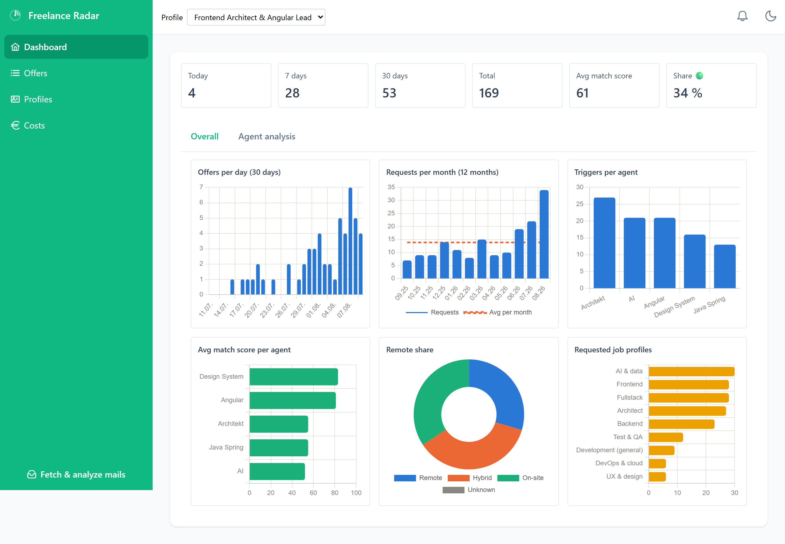
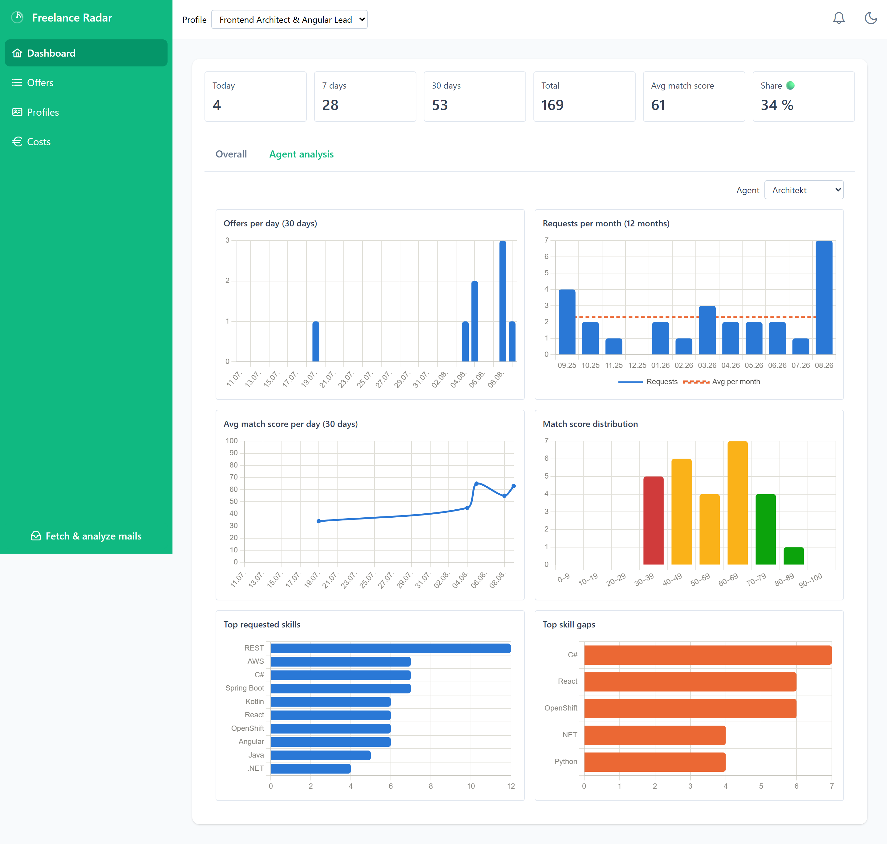
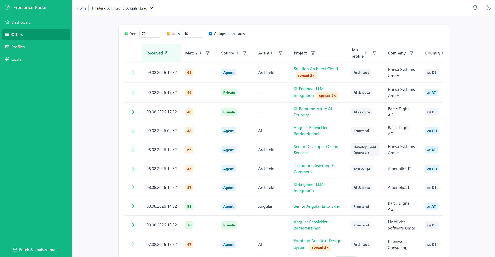
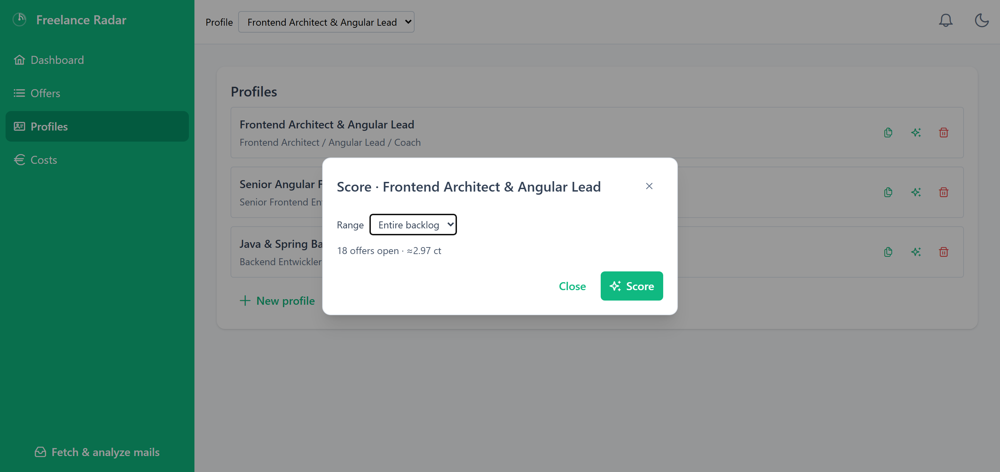
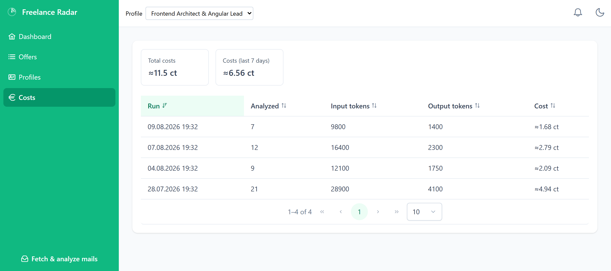

<div align="center">

# Freelance Radar

**Markt-Radar für IT-Freelance-Projektangebote — von der Angebots-Mail zur Entscheidungsgrundlage.**

Holt Angebots-Mails per IMAP ab, entdoppelt sie über Agenten hinweg und bewertet sie
mit Claude gegen ein eigenes Bewerbungsprofil: Match-Score, Skill-Gaps, Marktkennzahlen.
Ausgelöst per Knopfdruck — Tokens fließen nur, wenn ein Lauf bewusst gestartet wird.

[](https://github.com/themmerich/freelance-radar/actions/workflows/ci.yml)
[](LICENSE)




</div>

---

## Warum

Wer als Freelancer über Suchagenten Projektangebote bekommt, ertrinkt in Mails: dieselbe
Ausschreibung über mehrere Agenten, viel Rauschen, wenig Passendes. Freelance Radar
beantwortet die Fragen, die aus dem Posteingang allein nicht zu beantworten sind:

- **Wie viel kommt rein** — heute, in 7 Tagen, in 30 Tagen, insgesamt? Und wie viel
  war es im Schnitt pro Monat über das letzte Jahr?
- **Woher** — über welchen Suchagenten, per Direktanfrage oder als Rauschen?
- **Wie gut passt es** — Match-Score 0–100 gegen das eigene Profil, mit Begründung.
- **Was fehlt mir** — welche Skills verlangt der Markt, die im Profil nicht stehen?

Die Analyse läuft über die Claude API und kostet Geld. Deshalb ist Sparsamkeit ein
Designprinzip und kein Nachgedanke: ein Batch-Request statt einer Anfrage pro Angebot,
nur unbewertete Angebote, gekürzte Mail-Bodies, ein Kostendeckel pro Lauf — und jede
teure Aktion zeigt ihre geschätzten Kosten _vorher_ an. Ein voller Lauf über 25 Angebote
liegt bei rund **4 Cent**.

## Features

- **Ein-Klick-Lauf** — Mails abrufen, parsen, entdoppeln, bewerten; Fortschritt und
  Ergebnis als Toast, letzte Läufe hinter der Glocke in der Topbar.
- **Cross-Agent-Deduplizierung** — dieselbe Ausschreibung über mehrere Suchagenten wird
  über die stabile freelancermap-Projekt-ID gruppiert; nur der primäre Eintrag kostet
  Tokens und zählt in Auswertungen, die Kopien erscheinen als Badge „spread 3×".
- **Bewertung gegen mehrere Profile** — Ergebnisse liegen pro Profil nebeneinander, der
  Umschalter in der Topbar wechselt die komplette Sicht (Tabelle, KPIs, Charts).
- **Dashboard in zwei Tabs** — die KPI-Zeile (heute, 7 Tage, 30 Tage, gesamt, Ø Match-Score,
  🟢-Anteil) steht über beiden. _Gesamtauswertung_ zeigt die Marktsicht: Angebote pro Tag,
  Anfragen pro Monat über 12 Monate mit Durchschnittslinie, Trigger und Ø Score je
  Suchagent, Remote-Anteil, angefragte Berufsprofile. _Agenten-Analyse_ zeigt dieselben
  Zeitreihen plus Score-Trend, Score-Histogramm mit Ampelfarben, Top-Skills und
  Top-Skill-Gaps — alles gefiltert auf einen wählbaren Suchagenten.
- **Geclusterte Berufsprofile** — die Analyse liefert Rollen als Freitext, was in der Praxis
  auf ~145 Schreibweisen für 173 Angebote hinausläuft („Full-Stack Software Engineer",
  „Java-Fullstack-Entwickler", …). Schlüsselwort-Regeln fassen sie zu Clustern wie Fullstack,
  Architekt oder KI & Data zusammen — deterministisch, ohne zusätzliche Token.
- **Kostenkontrolle** — Token-Verbrauch pro Lauf protokolliert, Kostenseite mit Gesamt-
  und 7-Tage-Summe, Kostenvorschau vor jeder Neubewertung.
- **Einstellbare Ampel** — Schwellen für 🟢/🟡 und der Duplikat-Toggle liegen im
  localStorage, nicht im Code.
- **Hell/Dunkel und zweisprachig** — Theme-Umschalter und Transloco (Deutsch/Englisch).

## Screenshots

<table>
<tr>
<td colspan="2">

<p align="center"><em>Agenten-Analyse — dieselben Auswertungen, gefiltert auf einen wählbaren Suchagenten</em></p>
</td>
</tr>
<tr>
<td width="50%">

<p align="center"><em>Angebote — sortier- und filterbar, Ampel-Spalte, Duplikate zusammengefasst</em></p>
</td>
<td width="50%">

<p align="center"><em>Profile — anlegen, kopieren, löschen und den Bestand neu bewerten</em></p>
</td>
</tr>
<tr>
<td width="50%">

<p align="center"><em>Kosten — Gesamt- und 7-Tage-Summe, Tokens und Kosten je Lauf</em></p>
</td>
<td width="50%">

**Screenshots selbst erzeugen**

```bash
cd frontend
pnpm start          # Dev-Server
pnpm screenshots    # in zweiter Shell
```

[`scripts/screenshots.mjs`](frontend/scripts/screenshots.mjs) mockt die API mit
synthetischen Daten und legt die Bilder unter `docs/screenshots/` ab — reproduzierbar
und ohne echte Angebotsdaten.

</td>
</tr>
</table>

## Architektur

```
┌─────────────────────────────────────────────────────────────┐
│  Angular 22 + PrimeNG  ·  localhost:4200                    │
│  Dashboard · Angebote · Profile · Kosten                    │
│  Signals, zoneless, Sheriff-Modulgrenzen je Bounded Context │
└───────────────────────────┬─────────────────────────────────┘
                            │  REST  /api/offers · /api/runs
                            │        /api/profiles · /api/analyses
┌───────────────────────────▼─────────────────────────────────┐
│  Spring Boot 4.1 (Java 25)  ·  localhost:8080               │
│                                                             │
│  ImapService      GMX via jakarta.mail, wandernder          │
│                   Startdatum-Merker                         │
│  ParserService    Betreff/Body → Projektfelder, Agent-Name  │
│  CollectService   Message-ID-Dedup + Cross-Agent-Gruppen    │
│  AnalysisService  Spring AI 2.0 → claude-haiku-4-5,         │
│                   Batch-Prompt, Kostendeckel, Token-Log     │
└───────────────────────────┬─────────────────────────────────┘
                            │  JPA / Flyway
┌───────────────────────────▼─────────────────────────────────┐
│  PostgreSQL 18  ·  Docker `freelance-radar2-db`  ·  :5435   │
│  offers · offer_skills · offer_analyses · profiles · runs   │
└─────────────────────────────────────────────────────────────┘
```

**Token-Sparsamkeit im Detail:** Modell `claude-haiku-4-5`; ein Batch-Request pro Lauf
statt einer Anfrage pro Mail; nur unbewertete primäre Angebote; Mail-Body vor dem Prompt
gekürzt; das Profil byte-identisch im System-Prompt (Prompt-Caching-freundlich);
Kostendeckel `radar.analysis.max-offers-per-run` (Standard 50). Nur die ausdrücklich
bestätigte Bewertung des **gesamten** Bestands läuft ohne Deckel — dann weiterhin in
Paketen zu je 50, damit die Modellantwort im Token-Limit bleibt.

## Tech-Stack

| Bereich   | Technologien                                                                                           |
| --------- | ------------------------------------------------------------------------------------------------------ |
| Frontend  | Angular 22 (standalone, Signals, zoneless), PrimeNG, Tailwind CSS 4, NgRx Signals, Transloco, Chart.js |
| Backend   | Spring Boot 4.1, Java 25, Spring AI 2.0 (Anthropic), Spring Data JPA, Flyway, jakarta.mail             |
| Datenbank | PostgreSQL 18 (Docker Compose im Dev, Testcontainers in Tests)                                         |
| Build     | pnpm + Angular CLI, Gradle (Kotlin DSL)                                                                |
| Qualität  | ESLint + Prettier, Sheriff (Modulgrenzen), Vitest, Playwright, GitHub Actions                          |

## Projektstruktur

| Pfad                                         | Inhalt                                                                   |
| -------------------------------------------- | ------------------------------------------------------------------------ |
| [`frontend/`](frontend/README.md)            | Angular-App; Bounded Contexts `offers`, `profiles`, `costs`, `shared`    |
| [`backend/`](backend/AGENTS.md)              | Spring-Boot-Service; Pakete `offer`, `profile`, `analyze`, `collect`, `run` |
| [`style-guide/`](style-guide/style-guide.md) | Style-Guides je Dateityp (TypeScript, Templates, SCSS, a11y, Tests, Git) |
| [`.claude/skills/`](SKILLS.md)               | Agent-Skills für wiederkehrende Aufgaben, indiziert in `SKILLS.md`       |
| [`scripts/`](scripts/)                       | Verifikation: `verify.mjs` (Vollsuite) und der Claude-Code-Stop-Hook     |

Die Modulgrenzen sind nicht nur dokumentiert, sondern per
[Sheriff](https://github.com/softarc-consulting/sheriff) in ESLint erzwungen:
ein Scope sieht nur sich selbst und den Shared Kernel, und `ui` darf nicht auf
`data-access` zugreifen. Verstöße scheitern im Lint, nicht erst im Review.

## Voraussetzungen

- **Node.js 26+** mit Corepack (`corepack enable`) — Version gepinnt in [`.nvmrc`](.nvmrc),
  pnpm über das Feld `packageManager`. Kein npm, kein yarn.
- **Java 25** — Gradle kommt über den Wrapper.
- **Docker** — PostgreSQL startet im Dev-Betrieb automatisch über
  [`backend/compose.yaml`](backend/compose.yaml); Tests nutzen Testcontainers.

## Schnellstart

```bash
git clone https://github.com/themmerich/freelance-radar.git
cd freelance-radar
```

Backend (startet PostgreSQL via Docker Compose automatisch):

```bash
cd backend
./gradlew bootRun
```

Frontend:

```bash
cd frontend
pnpm install
pnpm start
```

Danach läuft die App auf <http://localhost:4200> und spricht über den Dev-Server-Proxy
mit dem Backend auf Port 8080.

## Konfiguration

Zugangsdaten liegen ausschließlich in git-ignorierten Dateien — niemals im Repo:

| Datei                                            | Inhalt                        | Vorlage                                                                                  |
| ------------------------------------------------ | ----------------------------- | ---------------------------------------------------------------------------------------- |
| `backend/application-local.properties`           | GMX-Zugang, Anthropic-API-Key | [`application-local.example.properties`](backend/application-local.example.properties)   |
| `frontend/src/environments/environment.local.ts` | PrimeNG-License-Key           | [`environment.local.example.ts`](frontend/src/environments/environment.local.example.ts) |

Die wichtigsten Stellschrauben in
[`application.properties`](backend/src/main/resources/application.properties):

| Property                            | Standard                                               | Wirkung                                    |
| ----------------------------------- | ------------------------------------------------------ | ------------------------------------------ |
| `radar.analysis.max-offers-per-run` | `50`                                                   | Kostendeckel bzw. Batch-Größe pro Lauf     |
| `radar.analysis.prompt-body-chars`  | `2000`                                                 | Kürzung des Mail-Bodys im Prompt           |
| `spring.ai.anthropic.chat.model`    | `claude-haiku-4-5`                                     | Analysemodell                              |
| `radar.agents`                      | `Angular,Architekt,Design System,Java Spring,KI/GenAI` | Erkennung des Agent-Namens aus dem Betreff |
| `radar.mail-domain`                 | `freelancermap.de`                                     | Nur Mails dieser Domain werden abgeholt    |

**Betriebshinweis:** Der IMAP-Abruf merkt sich das Datum der jüngsten verarbeiteten Mail
(`backend/.state/since-date.txt`). Abgerufene Mails dürfen danach im Postfach gelöscht
werden — die Datenbank ist ab dann die einzige Quelle. Die Datei löschen setzt den
Merker zurück.

## Verifikation

| Kommando                               | Umfang                                                                     |
| -------------------------------------- | -------------------------------------------------------------------------- |
| `node scripts/verify.mjs`              | Alles: Frontend Lint/Format/Tests/Build + Backend-Build                    |
| `pnpm lint` / `pnpm test` / `pnpm e2e` | Frontend, jeweils in `frontend/`                                           |
| `./gradlew build`                      | Backend, in `backend/` (braucht Docker — Tests laufen über Testcontainers) |

Dieselben Schritte laufen in GitHub Actions ([`ci.yml`](.github/workflows/ci.yml)); die
e2e-Tests dort gegen den Produktions-Build, damit produktionsspezifische Fehler auffallen.

## Roadmap

- [x] Gerüst & Datenfluss ohne LLM (IMAP, Parser, Dedup, Minimal-Dashboard)
- [x] Analyse mit Kostendeckel (Spring AI + Claude Haiku, Batch-Prompt)
- [x] Auswertungen: KPI-Kacheln und Charts
- [x] Profil-Verwaltung: mehrere Profile, Ergebnisse je Profil, Neubewertung mit Kostenvorschau
- [ ] Vergleichsansicht: Ø Score und 🟢-Quote je Profil nebeneinander
- [ ] Raten-Statistik und Wochen-Trend je Skill
- [ ] Obsidian-Export für Top-Matches
- [ ] Collect-Automatisierung per Task Scheduler (die Analyse bleibt manuell)

## Lizenz

[MIT](LICENSE) © Thomas Hemmerich
